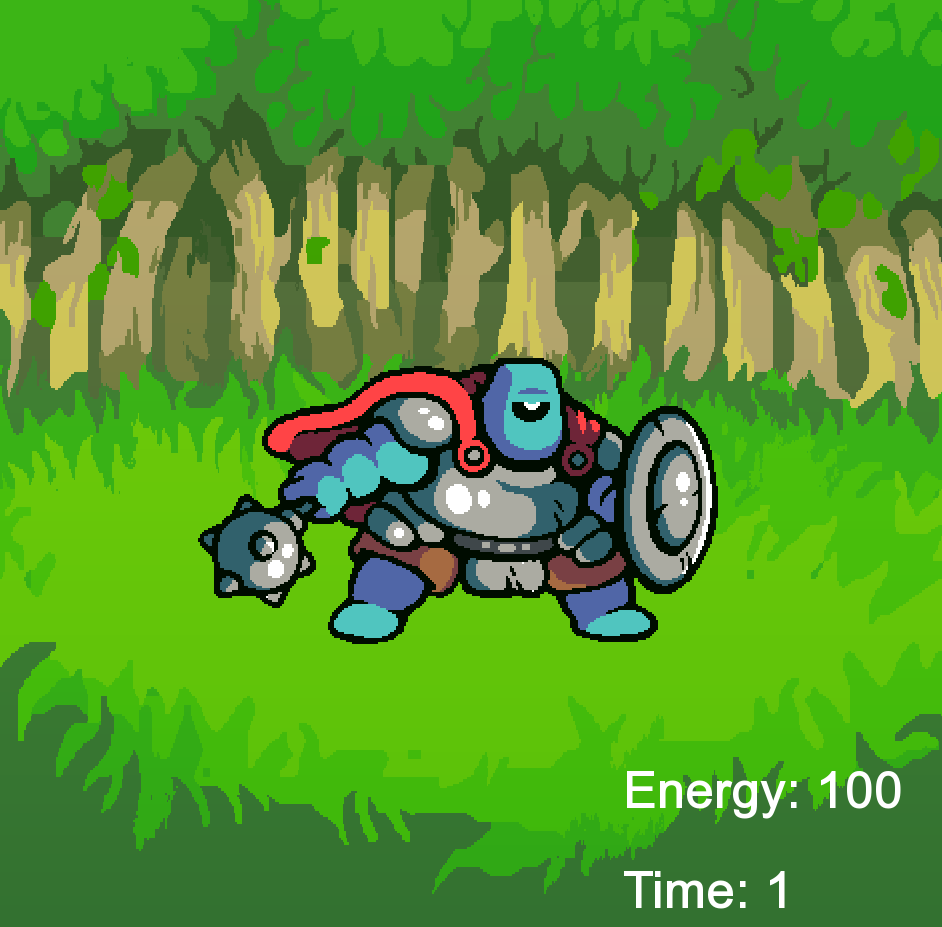
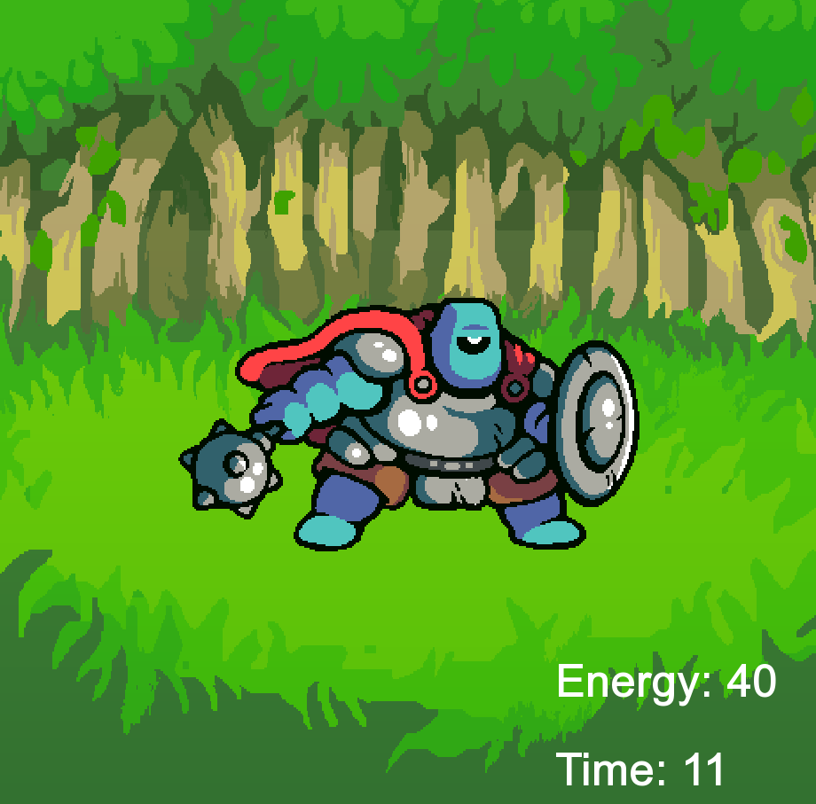
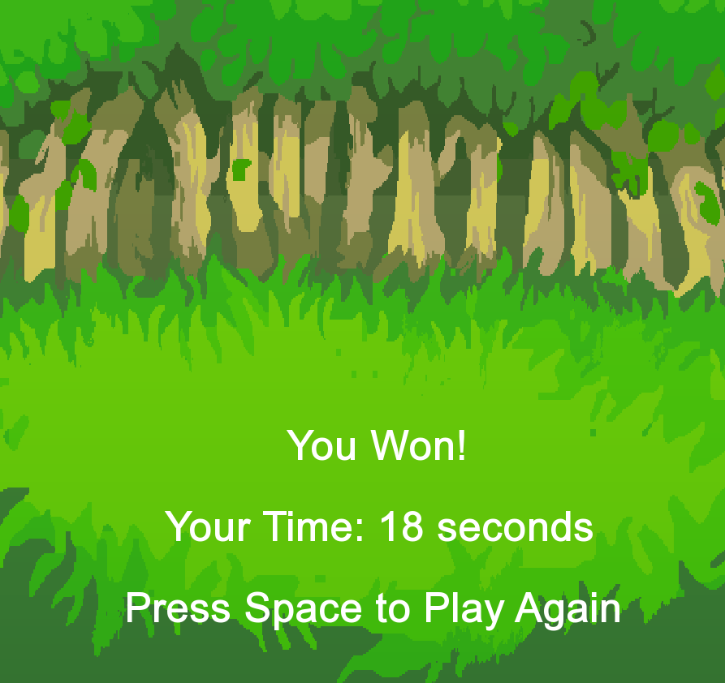

# SFML Clicker Game 🎮

A simple clicker game built with C++ and SFML 3.0 - my first project exploring game development with the SFML framework.

## 🎯 About

Click on the enemy to defeat it as fast as possible! This project demonstrates core game development concepts including:
- Sprite rendering and animation
- Event handling (mouse and keyboard input)
- Game state management
- Resource loading (textures, fonts, sounds)
- Real-time UI updates

## 📸 Screenshots

| Gameplay | In Action | Victory Screen |
|----------|-----------|----------------|
|  |  |  |

## 🚀 Features

- ✨ Interactive enemy sprite
- ⏱️ Real-time timer display
- 💪 Energy-based health system
- 🎵 Sound effects on attack
- 🏆 Victory screen with completion time
- ♻️ Replay functionality

## 🛠️ Technologies Used

- **Language:** C++17
- **Framework:** SFML 3.0
- **Compiler:** g++ (MinGW-w64)
- **Build System:** Direct compilation

## 📋 Prerequisites

- C++17 compatible compiler (g++, clang++, MSVC)
- SFML 3.0 library
- Windows/Linux/macOS

## 🔧 Installation & Setup

### 1. Clone the Repository
- git clone https://github.com/MohitWarrier/SFML-Clicker-Game.git
- cd SFML-Clicker-Game

### 2. Install SFML 3.0
**Windows (MinGW):**
- Download SFML 3.0 from https://www.sfml-dev.org/download.php
- Extract to C:\SFML (or preferred location)

**From project root**
- g++ src/gameWorld.cpp src/enemy.cpp src/texts.cpp src/main.cpp -o game.exe -IC:\SFML\include -LC:\SFML\lib -lsfml-graphics -lsfml-window -lsfml-audio -lsfml-system
- Adjust paths for your SFML installation location.

### 4. Run
- ./game.exe
